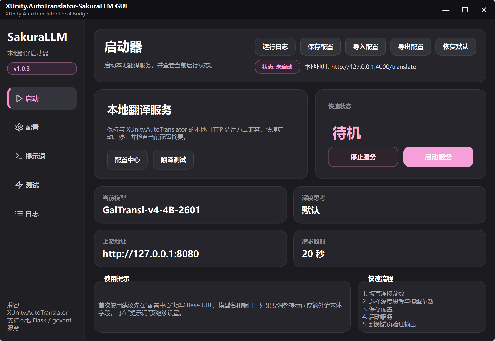

# XUnity.AutoTranslator-SakuraLLM GUI

[简体中文](https://github.com/1738348785/XUnity.AutoTranslator-SakuraLLM/blob/gui-main/README.md) · English

The GUI edition of `XUnity.AutoTranslator-SakuraLLM`. Configure, launch, test, and inspect logs — all from a desktop window.



## Features

- 🖥️ **Fully graphical setup** — API endpoint, model, port, headers, prompt, all configurable in the UI
- ⚡ **True concurrent translation** — gevent coroutines + tunable concurrency cap; no more line-by-line subtitle lag on scene changes
- 💾 **LRU translation cache** — repeated text (menus, system prompts) hits in milliseconds, saves GPU compute
- 🔀 **In-flight deduplication** — multiple simultaneous identical requests share a single model call
- 🩺 **Backend health check** — on service start, connectivity is verified and surfaced in logs immediately
- 🎛️ **Live parameter updates** — change `max_concurrency` without restarting the service
- 💬 **Prompt presets** — switch translation styles with one click
- 🌐 **Bilingual UI (EN / zh-CN)** + system tray minimization

## Quick Start

### Option 1: Download the exe (recommended)

Grab the latest `XUnity.AutoTranslator-SakuraLLM GUI.exe` from the [Releases](https://github.com/1738348785/XUnity.AutoTranslator-SakuraLLM/releases) page and double-click.

### Option 2: Run from source

```bash
pip install -r requirements.txt
python app.py
```

> Python 3.10+ required. Windows recommended.

## Setup Flow

1. Fill in **Base URL** (SakuraLLM or any OpenAI-compatible endpoint, e.g. `http://127.0.0.1:8080`)
2. Fill in the **model name**
3. Set the **local listening port** (default 4000)
4. Tune temperature, Top-P, max concurrency as needed
5. Click **Save Config** → **Start Service**
6. Go to the **Translation Test** page to verify output

## Connecting with XUnity.AutoTranslator

Edit `AutoTranslatorConfig.ini`:

```ini
[Service]
Endpoint=CustomTranslate
FallbackEndpoint=

[Custom]
Url=http://127.0.0.1:4000/translate
```

If you change the local port, update the `Url` here too.

## Key Parameters

| Parameter | Description | Recommended |
|---|---|---|
| `temperature` | Sampling temperature; lower = more stable | `0.1 - 0.5` |
| `top_p` | Nucleus sampling threshold | `0.8` |
| `max_tokens` | Per-response generation cap | `2048` |
| `max_concurrency` | Max parallel requests (**live-tunable**) | `2 - 8`, depends on backend |
| `max_retries` | Retries when validation fails | `3` |
| `repeat_count` | Repetition detection threshold | `8` |

## Custom Headers

For upstream parameters like DeepSeek-R1's `reasoning_effort`, set it dedicatedly in the config page, or inject via custom header JSON:

```json
{
  "reasoning_effort": "low"
}
```

The custom header takes precedence if both are set.

## Config File Location

- **From source**: `data/config.json` in the project directory
- **Packaged exe**: `data/config.json` next to the `.exe`

Writes are atomic (temp file + replace), so crashes won't corrupt the config.

## Troubleshooting

**Translation fails / slow?**
- Bump `max_concurrency` to 4-8 in the config page
- Confirm the backend (llama.cpp / KoboldCpp / etc.) is running — after service start, logs will show "Backend is reachable" or "Backend unreachable"

**Port in use?**
- Pick a different port or close the program holding it. The error is surfaced in the log panel immediately.

**Packaged exe startup slow?**
- First launch unpacks to a temp directory; subsequent launches are faster.

## Branches

- `main`: upstream mainline
- `gui-main`: GUI edition (this branch)
